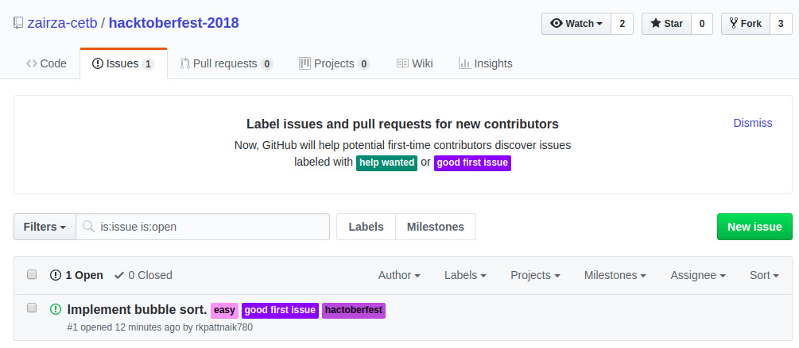
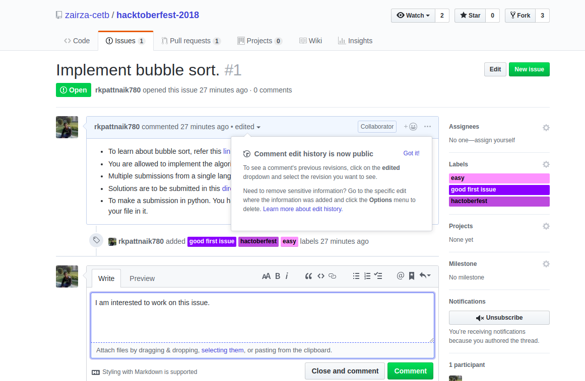
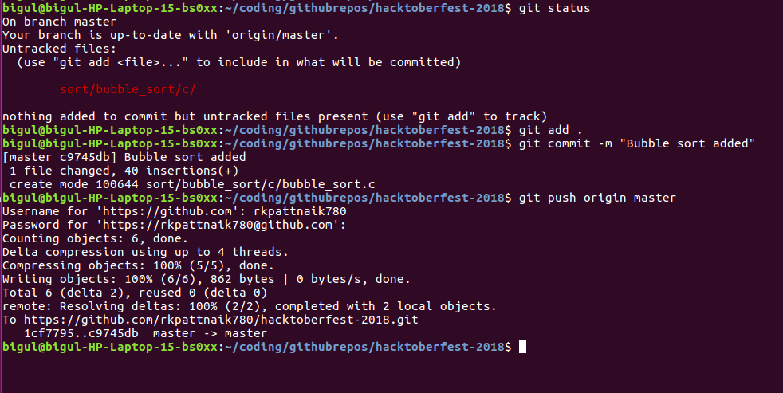
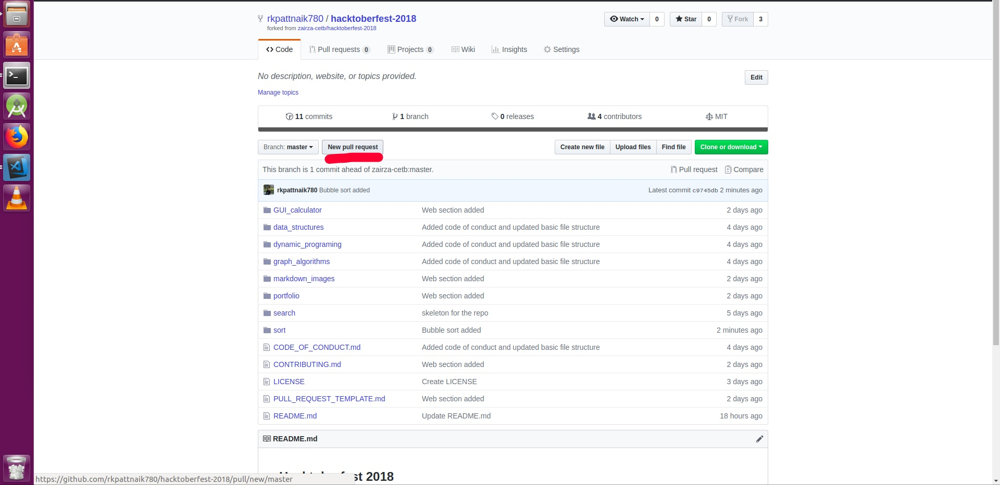
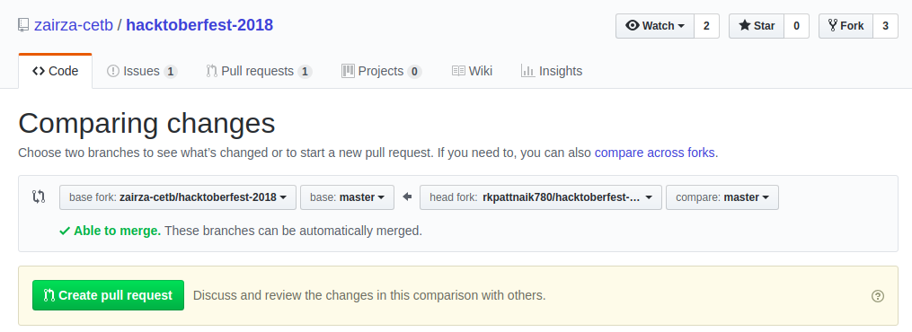
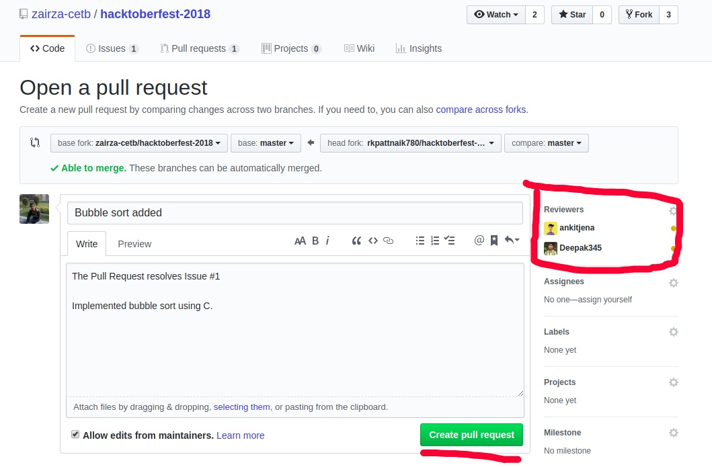

# CONTRIBUTING to this repository

* The repository aims to help people to get started with making pull requests.

## Forking the repository

Forking a repository allows you to freely experiment with changes without affecting the original project. Most commonly, forks are used to either propose changes to someone else's project or to use someone else's project as a starting point for your own idea.
  

## Cloning 

Cloning is used to create a local copy of the repository. It takes only one command in the terminal to clone the repository. 

    git clone https://github.com/<your-username>/hacktoberfest-2018.git

## Choosing an issue to work upon

Go to the [issues section](https://github.com/zairza-cetb/hacktoberfest-2018/issues), to find a list of open issues. 
 

* Select the issues you are interested to work upon based upon the labels and descriptions.
* You need to claim the issue to let others know you're working upon it. 

 

## Making changes to the codebase

* Follow the instructions provided in the issue and readme doc.
* Don't violate the directory structure.
* Save your changes.

## Add, Commit and Push 
 
Follow these commands to push the changes to your branch. 
 

    git add .
    git commit -m "Issue solved"
    git push origin master

## Opening a pull request
 

1. Click on <b>New Pull Request</b>
 

2. Make sure that the branches can be automatically merged and then click : <b>Create pull request</b> .
 

 
3. Edit the auto-generated template. Give correct reference to the issue being addressed and add as many reviewers you can for quick merging of the pull request.
 

