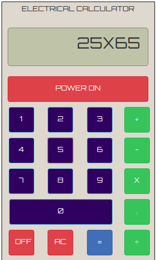

### Menu Based Calculator 

In this section, users are invited to create a simple menu driven calculator. Basic operations such as addition, subtraction, division and multiplication are compulsary to be implemented. Users are also adviced to attach a markdown file in their submitted directory briefing the steps to run the calculator. 

### Format to submit

> GUI_calculator/user_name

### Sample 

A sample menu driven calculator 
